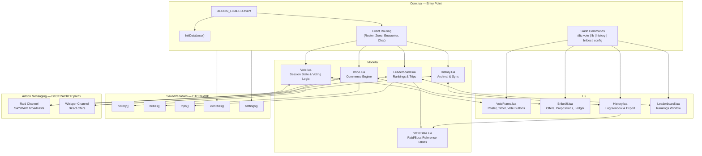
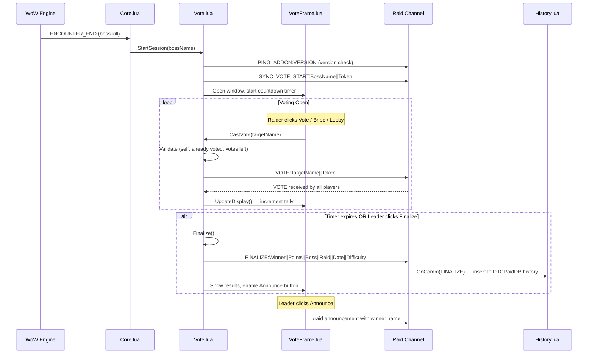
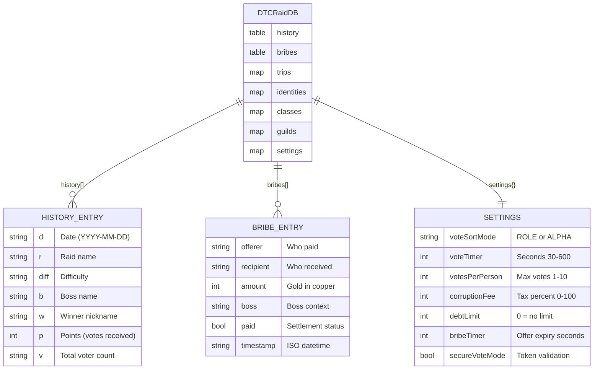
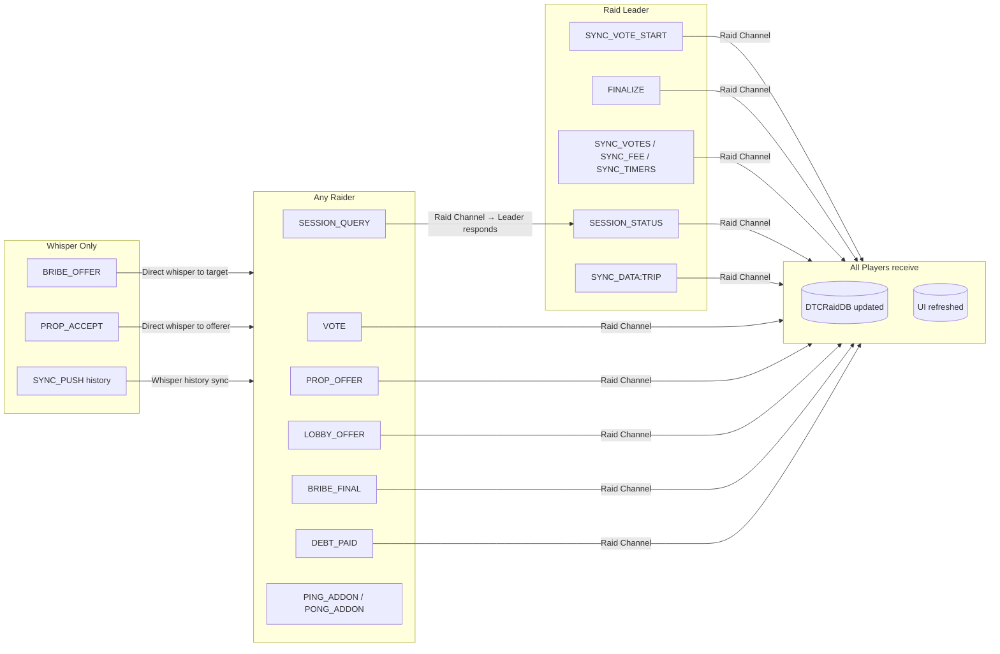

# DTC Raid Tracker (v7.3.17)

**DTC Raid Tracker** is a modular World of Warcraft addon designed to track raid attendance, performance voting, and leaderboard stats. Version 7.1 introduces major architectural improvements and a new **"Game Theory"** module that allows players to leverage gold to influence the vote via Bribes, Propositions, and Lobbying.

## 🚀 Key Features

### 1. Voting System
* **Weighted Voting:** Every raider gets 3 votes per boss kill.
* **Role Sorting:** View the roster sorted by Tank, Healer, and DPS/Other.
* **Smart Validation:** Blocks self-voting and prevents voting if a player has disconnected or has an outdated addon version.
* **Secure Session:** Only the Raid Leader can finalize or announce results. Includes a "Force Start" option for unrecognized raid zones.
* **Tie-Breakers:** Standardized sorting (highest vote count wins).

### 2. "Game Theory" & Commerce
Turn your raid into a marketplace! Players can now leverage their gold to influence the outcome.
* **💰 Bribes:** Offer gold to a specific player to secure one of their votes.
* **📜 Propositions:** Selling your own vote? Broadcast a "Proposition" to the raid, setting a price for your support.
* **🤝 Lobbying:** Fund a campaign! Pay other players to vote for a specific candidate.
* **💸 Corruption Fee:** A configurable tax (default 10%) on all bribes and lobbying is funneled to the Raid Leader.
* **Debt Tracking:** The addon tracks who has paid and who owes money.
    * *Deadbeat Protocol:* If you have unpaid debts from a previous boss, your ability to bribe/lobby is disabled until you settle up.
    * *Secure Payments:* Only the creditor can mark a debt as paid, preventing fraud.
* **Automated Trading:** Clicking "Trade" in the Bribe Ledger automatically opens the trade window and fills in the correct gold amount.
* **Solo Mode:** All features are available while Solo to facilitate testing.

### 3. Leaderboards & History
* **Leaderboard:** Track who has the most votes across the entire expansion, specific raids, or bosses.
* **Detailed History:** A searchable log of every vote cast, complete with dates, difficulty settings, and winners.
* **Export:** Export history data to CSV for external spreadsheet tracking.

### 4. Roster Management
* **Auto-Nicknames:** Automatically populates nicknames based on character names when entering a valid raid instance (excludes LFR).
* **Guild Sorting:** Groups players by Guild in the configuration menu for easier management.
* **One-Click Clean:** Delete players or reset the entire database with a single click.

---

## 📂 Installation

1.  Download the latest release.
2.  Extract the `DTC_RaidTracker` folder to your WoW Addons directory:
    `_retail_\Interface\AddOns\DTC_RaidTracker`
3.  **Restart WoW** (Do not just reload UI) to ensure new files are loaded.

---

## 🛠️ Configuration

Type `/dtc config` to open the options panel.

* **General:** Test buttons for Voting, Leaderboard, and Bribe simulation.
* **Nicknames:** Set custom nicknames for your raiders.
* **Bribes:** Configure expiration timers for Bribes (Default: 90s), Propositions (90s), and Lobbying (120s).

### Slash Commands
| Command | Description |
| :--- | :--- |
| `/dtc vote` | Toggle the Voting Window |
| `/dtc lb` | Toggle the Leaderboard |
| `/dtc history` | Toggle the Vote History Log |
| `/dtc bribes` | Toggle the Bribe Ledger (Debt Tracker) |
| `/dtc config` | Open Settings |
| `/dtc reset` | **WIPE** all data (Use with caution) |

---

## 🏗️ Developer Notes (Folder Structure)

This addon uses a modular architecture to separate Logic, UI, and Data.

```text
DTC_RaidTracker/
├── DTC_RaidTracker.toc      # Addon Manifest
├── Core.lua                 # Init, Slash Commands, Database Handling
├── Config.lua               # Options Panel & Tab Logic
├── Localization.lua         # String Constants
│
├── Utils/
│   └── Helpers.lua          # Shared Utilities
│
├── Models/
│   ├── StaticData.lua       # Raid/Boss ID tables
│   ├── Vote.lua             # Voting Logic & Session State
│   ├── Leaderboard.lua      # Stat Calculation
│   ├── History.lua          # Logging & Syncing
│   └── Bribe.lua            # Commerce Logic (Bribes/Props/Lobbying)
│
└── UI/
    ├── Widgets.xml          # Shared Window Templates
    ├── VoteFrame.xml/lua    # Main Voting Window
    ├── Leaderboard.xml/lua  # Ranking Window
    ├── History.xml/lua      # Log Window
    └── BribeUI.xml/lua      # Popups, Trackers & Lists
```

---

## 🗺️ Logic Flow Diagrams

### System Architecture Overview



---

### Vote Session Lifecycle



---

### Commerce (Bribe / Proposition / Lobby) Flow

```mermaid
flowchart TD
    A([Player opens Vote Window]) --> B{Choose action}

    B --> C[Direct Bribe]
    B --> D[Proposition]
    B --> E[Lobby]

    subgraph Direct_Bribe["💰 Direct Bribe"]
        C --> C1[Enter gold amount]
        C1 --> C2[Bribe:OfferBribe — whisper BRIBE_OFFER to target]
        C2 --> C3{Target receives offer}
        C3 -->|Accept| C4[Bribe:AcceptOffer]
        C3 -->|Decline / Expires| C5[Offer removed from queue]
        C4 --> C6[Vote:CastVote for offerer]
        C6 --> C7[Broadcast BRIBE_FINAL]
        C7 --> C8[All players: TrackBribe — add to DTCRaidDB.bribes]
        C8 --> C9[Add corruption fee entry for leader]
    end

    subgraph Proposition["📜 Proposition"]
        D --> D1[Enter asking price]
        D1 --> D2[Bribe:SendProposition — broadcast PROP_OFFER to raid]
        D2 --> D3{Another player accepts}
        D3 -->|PROP_ACCEPT whisper| D4[OnPropositionAcceptedByMe]
        D4 --> D5[Cast vote for acceptor]
        D5 --> D6[Broadcast BRIBE_FINAL]
        D6 --> C8
    end

    subgraph Lobby["🤝 Lobby"]
        E --> E1[Enter candidate name + gold amount]
        E1 --> E2[Bribe:SendLobby — broadcast LOBBY_OFFER to raid]
        E2 --> E3{Raid member accepts lobby}
        E3 --> E4[Cast vote for specified candidate]
        E4 --> E6[Broadcast BRIBE_FINAL with type=LOBBY]
        E6 --> C8
    end

    subgraph Debt_Resolution["💸 Debt Resolution"]
        C8 --> DR1[entry.paid = false in DTCRaidDB.bribes]
        DR1 --> DR2{Creditor opens Bribe Ledger}
        DR2 --> DR3[Click Initiate Trade]
        DR3 --> DR4[Bribe:InitiateTrade — open trade window]
        DR4 --> DR5{TRADE_CLOSED — enough gold?}
        DR5 -->|Yes| DR6[entry.paid = true]
        DR6 --> DR7[Broadcast DEBT_PAID to raid]
        DR7 --> DR8[All players mark entry paid]
        DR5 -->|No| DR9[Trade cancelled — debt remains]
    end

    style Direct_Bribe fill:#2d1f00,stroke:#c8860a
    style Proposition fill:#001f2d,stroke:#0a7ec8
    style Lobby fill:#1f2d00,stroke:#6ac80a
    style Debt_Resolution fill:#2d0000,stroke:#c80a0a
```



---

### Data Persistence & Sync



---

### Network Message Protocol



---

## 📜 License
Author: Voltrizzy

Version: 7.3.17

Project ID: 1442970 (CurseForge) / 56ndd5G9 (Wago)
